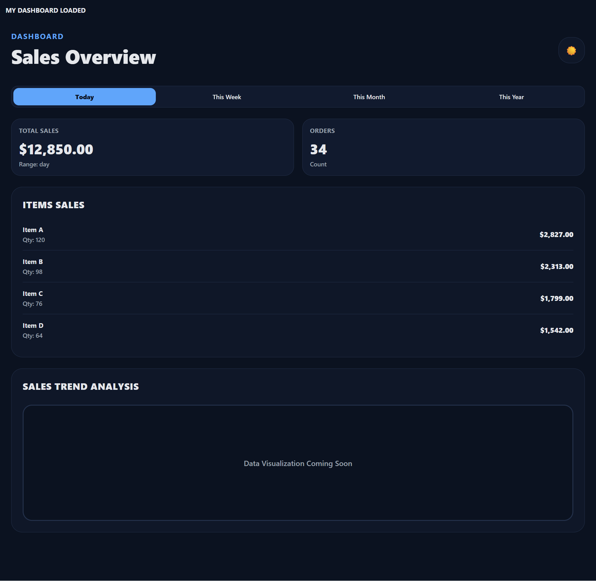
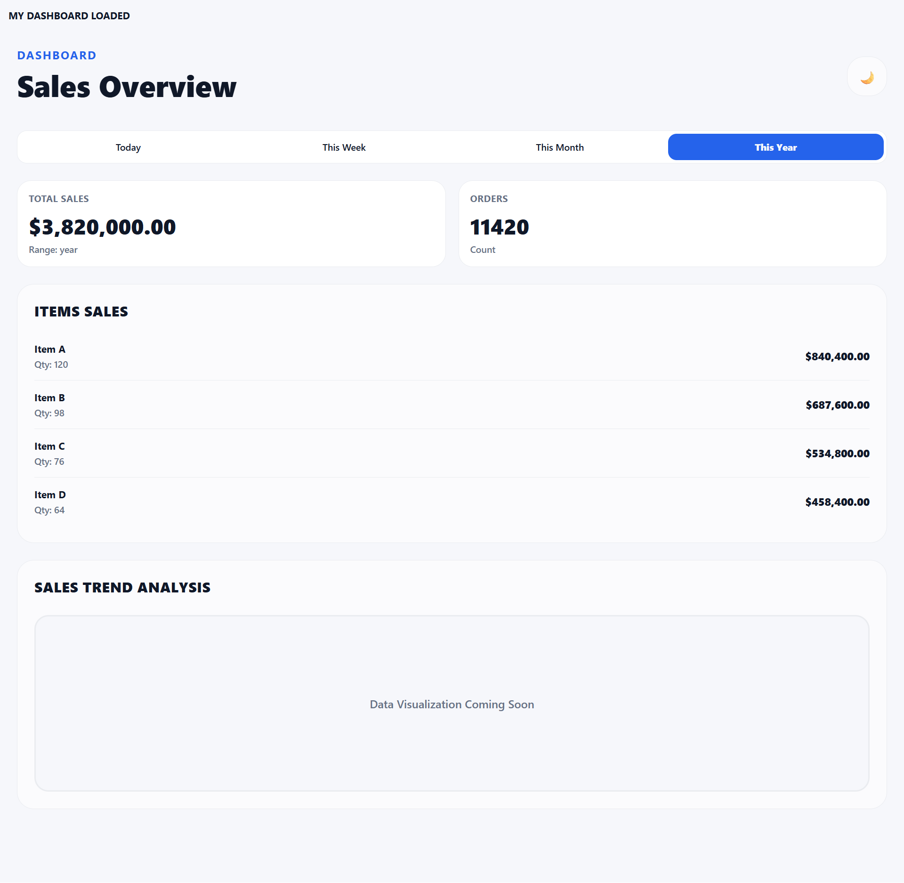
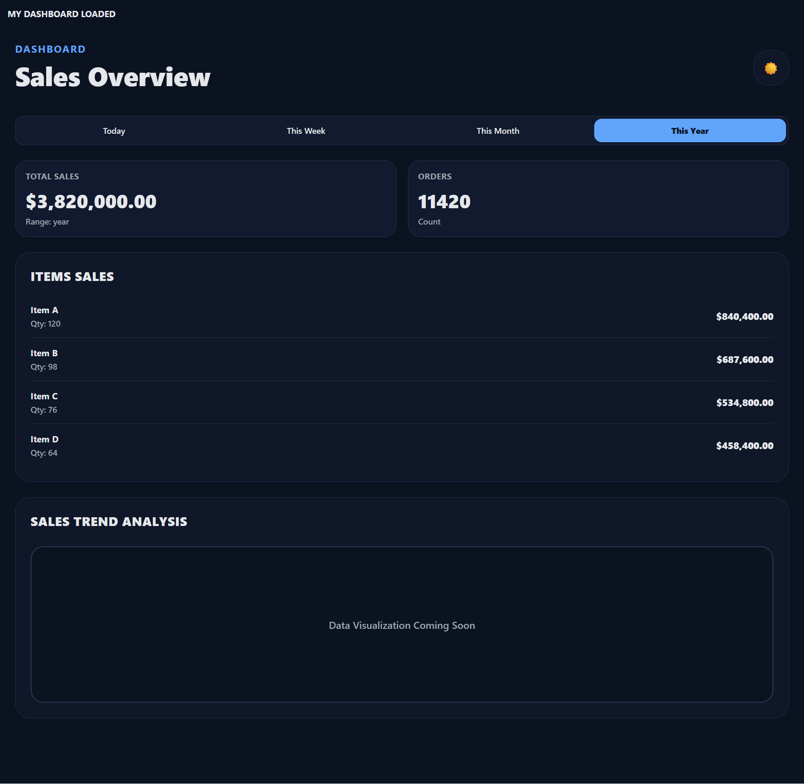

# Welcome to Expo app 

Here are some of the screenshots of the app

This is an [Expo](https://expo.dev) project created with [`create-expo-app`](https://www.npmjs.com/package/create-expo-app).

This command will move the starter code to the **app-example** directory and create a blank **app** directory where you can start developing.

## Learn more

To learn more about developing your project with Expo, look at the following resources:

- [Expo documentation](https://docs.expo.dev/): Learn fundamentals, or go into advanced topics with our [guides](https://docs.expo.dev/guides).
- [Learn Expo tutorial](https://docs.expo.dev/tutorial/introduction/): Follow a step-by-step tutorial where you'll create a project that runs on Android, iOS, and the web.

## Join the community

Join our community of developers creating universal apps.

- [Expo on GitHub](https://github.com/expo/expo): View our open source platform and contribute.
- [Discord community](https://chat.expo.dev): Chat with Expo users and ask questions.

# React-Native-Sales-Dashboard
A React Native project implementing MVVM architecture, offering a clean separation of concerns for maintainable and scalable development. It includes support for localization, allowing multiple languages, and a flexible theme system with dark/light modes for better UI customization. Easily extensible for future features.
>>>>>>> 381db1cccc4ba36066e63546f05aaf2ca8980908
